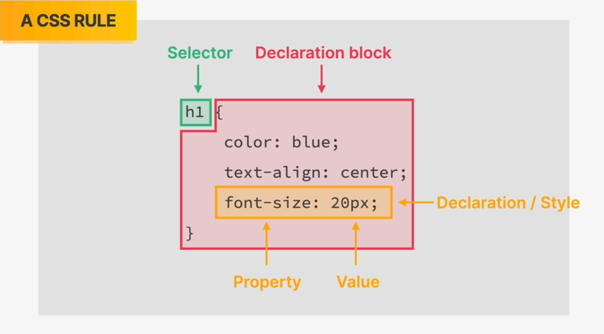

## 1.0 Introduction to CSS :

## What is CSS ??

👉 CSS : **C**ascading **S**tyle **S**heet

👉 CSS describes the **visual style and presentation** of the **content written in HTML**

👉 CSS consists of countless **properties** that developers use to format
the content: properties about font, text, spacing, layout, etc.

There are several different properties in CSS and we can't learn all fo it

We get familiar with the properties by using them again and again and exploring CSS during learning and project works

## How we Select & Style Elements ??

There are different terminologies used :

- Selector
- Property
- Value
- Declaration (Property + Value)
- Declaration block



- There can be 1 / more declaration inside the declaration block

- So all this together the selector + declaration block is called a **_CSS Rule_**

- _Our CSS Code has many different CSS rules written in it to style our page_

## 2.0 Inline , Internal & External CSS :

### What is Inline CSS ??

Inline CSS refers to the practice of placing CSS (Cascading Style Sheets) directly within the HTML document, rather than in a separate external stylesheet. This is done by using the style attribute within HTML tags.

**Here's an example :**

```html
<h1 style="color: blue; text-align: center;"></h1>
```

### What is Internal CSS ??

Internal CSS, also known as embedded CSS, involves placing the CSS code directly within the HTML document, but it is located within the `<style> </style>` tag in the document's `<head> </head>` section.

This allows you to keep the styling information within the HTML file itself while still separating it from the main content.

**Here's an example :**

```html
<!DOCTYPE html>
<html lang="en">
  <head>
    <meta charset="UTF-8" />
    <meta name="viewport" content="width=device-width, initial-scale=1.0" />
    <title>Internal CSS Example</title>
    <style>
      h1 {
        color: blue;
        text-align: center;
      }
      p {
        font-size: 18px;
        color: green;
      }
    </style>
  </head>
  <body>
    <h1>This is a heading with internal CSS</h1>
    <p>This is a paragraph with internal CSS.</p>
  </body>
</html>
```

### What is External CSS ??

External CSS involves placing the CSS code in a separate external file with a .css extension, and then linking that file to the HTML document.

This approach is commonly used for larger projects or when you want to apply consistent styles across multiple pages.

**Here's an example :**

**_style.css_** :

```css /* styles.css */
h1 {
  color: blue;
  text-align: center;
}

p {
  font-size: 18px;
  color: green;
}
```

**_index.html_** :

```html <!DOCTYPE html>
<html lang="en">
  <head>
    <meta charset="UTF-8" />
    <meta name="viewport" content="width=device-width, initial-scale=1.0" />
    <title>External CSS Example</title>

    <!-- Linking to the external CSS file -->
    <link rel="stylesheet" href="style.css" />
  </head>
  <body>
    <h1>This is a heading with external CSS</h1>

    <p>This is a paragraph with external CSS.</p>
  </body>
</html>
```

Here you can see that the HTML **`<head> </head>`** section has an extra **`<link rel="stylesheet" href="style.css" />`**
line it . this is used to link the style.css file with the index.html file

### Which is the best way to write CSS Code ??

The choice between inline, internal, and external CSS depends on the specific requirements and the scope of your project. Each type of CSS writing has its own advantages and use cases.

Here's a summary:

**👉 Inline CSS:**

Advantages:

- Quick and easy for small-scale styling.
- No need to create separate files.

Disadvantages:

- Can lead to code repetition and decreased maintainability.
- Violates the separation of concerns principle.

**👉 Internal CSS (Embedded CSS):**

Advantages:

- More organized than inline CSS.
- Styles are contained within the HTML file.

Disadvantages:

Still violates the separation of concerns to some extent.
May become less maintainable for larger projects.

**👉 External CSS:**

Advantages:

- Best practice for larger projects and consistent styling across multiple pages.
- Promotes separation of concerns and modular development.
- Easier to maintain and update styles centrally.

Disadvantages:

- Requires an additional file and an HTTP request to fetch the external stylesheet.
- Best Practices:

**_Summary :_**

For small projects or quick prototyping, **_inline or internal CSS_** might be sufficient and convenient.

For larger projects or when consistency across multiple pages is crucial, external CSS is generally preferred.

Use a combination of approaches when necessary. For example, you might use external CSS for global styles and internal or inline CSS for specific, localized styles.

_However I personally prefer to use the external css very often as its easy to manage and navigate to all styles and properties for me_

## 3.0 Styling Texts :

Here we learn about some basic styling for texts :

- Color:

  - Description : Sets the text color of an element.

  * Example:

    ```css
    h1 {
      color: red;
    }
    ```

2. Font-size:

- Description : Specifies the size of the font.

- Example:

  ```css
  h1 {
    color: red;
    font-size: 16px;
  }
  ```

3. Font-family:

- Description : Defines the font family for text.

- Example:

  ```css
  h1 {
    color: red;
    font-size: 16px;
    font-family: 'Arial', sans-serif;
  }
  ```

1. Text-transform:

- Description : Controls the capitalization of text.

- Example:

  ```css
  h1 {
    color: red;
    font-size: 16px;
    font-family: 'Arial', sans-serif;
    text-transform: uppercase;
  }
  ```

5. Font-style:

- Description : Sets the style of the font (normal, italic, or oblique).

- Example:

  ```css
  h1 {
    color: red;
    font-size: 16px;
    font-family: 'Arial', sans-serif;
    text-transform: uppercase;
    font-style: italic;
  }
  ```

6. Line-height:

- Description : Specifies the height of a line of text. It is unit-less and relative to the text size of the content. So 1.5 means that the line height is 1.5 times the size of the font used

- Example:

  ```css
  h1 {
    color: red;
    font-size: 16px;
    font-family: 'Arial', sans-serif;
    text-transform: uppercase;
    font-style: italic;
    line-height: 1.5;
  }
  ```

7. Text-align:

- Description : Aligns the text within an element (left, right, center, or justify).

- Example:

  ```css
  h1 {
    color: red;
    font-size: 16px;
    font-family: 'Arial', sans-serif;
    text-transform: uppercase;
    font-style: italic;
    line-height: 1.5;
    text-align: center;
  }
  ```

## 4.0 Combining Selectors :

To apply same style / CSS properties to a bunch of selectors we do not have to write them separately again and again

Combining selectors in CSS allows you to apply styles to specific elements based on various conditions or relationships between them.

There are different ways to combine selectors to target specific elements. Here are some common techniques :

➡️ **_Grouping Selectors:_**

Use a comma to group multiple selectors and apply the same styles to each of them.

Example:

```css
h1,
h2,
h3,
h4,
p,
li {
  font-family: sans-serif;
}
```

In this example, the styles are applied to `<h1>`, `<h2>`, and `<h3>`,`<h4>`,`<p>`,`<li>` elements.

➡️ **_Descendant Selector (Whitespace) :_**

A descendant is an element that is contained within another element

Targets an element that is a descendant of another specified element.

Example:

```css
footer p {
  font-size: 16px;
}

article header p {
  font-style: italic;
}
```

In this example, the styles apply to all `<p>` elements that are descendants / child of an `<article>` element.

➡️ **_Child Selector (>):_**

Selects an element that is a direct child of another specified element.

Example:

```css
nav > ul {
  list-style-type: none;
  margin: 0;
  padding: 0;
}
```

This targets the `<ul>` element that is a direct child of the `<nav>` element.

➡️ **_Adjacent Sibling Selector (+):_**

Selects an element that is immediately preceded by a specified element.

Example:

```css
h2 + p {
  font-style: italic;
}
```

This targets `<p>` elements that directly follow an `<h2>` element.

➡️ **_General Sibling Selector (~):_**

Selects all elements that are siblings of a specified element.

Example:

```css
h2 ~ p {
  color: gray;
}
```

This targets all `<p>` elements that are siblings of an `<h2>` element.

These techniques offer flexibility in styling elements based on their relationships within the HTML document.

Combining selectors efficiently allows you to create more targeted and specific styles for your webpage.

## 5.0 Class & ID Selectors :

In HTML and CSS, classes and IDs are attributes that can be assigned to HTML elements to uniquely identify or group them. Classes and IDs are commonly used with CSS to apply styles

➡️ **_Class : _**

Definition: A class is a way to group multiple HTML elements together and apply the same styles to all elements with that class.

Syntax in HTML: class="class-name"

Example HTML:

```html
<p class="highlight">This is a highlighted paragraph.</p>
<div class="highlight">This is a highlighted div.</div>
```

CSS Selector for Classes: Use a period (.) followed by the class name.
Example CSS:

```css
.highlight {
  color: blue;
  font-weight: bold;
}
```

➡️ **_ID :_**

Definition: An ID is used to uniquely identify a single HTML element on a page. IDs should be unique within a document.

Also an ID Name can only be used once for any element in a document .Different elements can't have the same id name

Syntax in HTML: id="uniqueId"

Example HTML:

```html
<p id="main-paragraph">This is the main paragraph.</p>
```

CSS Selector for IDs: Use a hash (#) followed by the ID name.
Example CSS:

```css
#main-paragraph {
  font-size: 18px;
  color: green;
}
```

**_Classes are suitable for styling multiple elements similarly, while IDs are useful for uniquely identifying and styling individual elements. Keep in mind that it's good practice to use classes for styling and reserve IDs for unique identifiers._**

### How to remove Bullets of un-organized list ??

we use the `list-style` property of ul and set it to _none_ to remove the bullet points of unorganized list

```css
ul {
  list-style: none;
}
```

## 6.0 Working with Colors :

### How to Represent Colors using codes ?

Colors in CSS can be represented using various methods. Here are some common ways to represent colors in CSS :

➡️ **_Named Colors:_**

- This is the most basic way to represent colors in CSS.

- CSS supports a set of predefined color names.

  For example:

  ```css
  .container {
    color: red;
    background-color: blue;
  }
  ```

You can find a list of named colors in the CSS specification.

➡️ **_RGB Function:_**

- The RGB function allows you to specify a color using its red, green, and blue components.

- Every color can be represented as a combination of Red , Blue & Green components

- Each component is a value between 0 and 255.


```css
.container {
  color: rgb(255, 0, 0); /* Red */
  color: rgb(255, 255, 255); /* White */
}
```

➡️ RGBA Function:

- Similar to RGB, the RGBA function allows you to specify a color with an additional alpha channel for transparency.

- The alpha value is a number between **_0 ('fully transparent') and 1 ('fully opaque')_**.

  For example:

  ```css
  .container {
    color: rgba(255, 0, 0, 0.5); /*     Semi-transparent red */
    background-color: rgba(0, 0, 255, 0 7); /* Semi-transparent blue */
  }
  ```

➡️ Hexadecimal Notation:

- Colors can be represented using hexadecimal values.

- Hex values are six characters long and consist of numbers (0-9) and letters (A-F).

**Short Hand Notation :**

- Red is written as **'#ff0000'** & White is written as #ffffff

- In cases like these where the letters or numbers are repeating shorthand notation can be used .

- **#f00** & #fff Represents Red & White colors too just in shorthand form.

For Example :

```css
.container {
  color: #ff0000; /* Red */
  background-color: #0000ff; /* Blue */
}
```

➡️ **_HSL Function:_**

- The HSL function represents a color in terms of its hue, saturation, and lightness.

- Hue is a degree on the color wheel (0 to 360), saturation is a percentage (0% to 100%), and lightness is also a percentage (0% to 100%).

  For example :

  ````css
  .container {
    color: hsl(0, 100%, 50%); /* Red */
    background-color: hsl(240,   100%,     ```
  ````

➡️ **_HSLA Function:_**

- Similar to HSL, the HSLA function allows you to specify a color with an additional alpha channel for transparency.

  For example :

  ```css
  .container {
   color: hsla(0, 100%, 50%, 0.5); /*    Semi-transparent red */
  background-color: hsla(240, 100%,    50%, 0.7); /* Semi-transparent blue */

  ```

### Shades of Grey :

- When Colors in all three channels are same we get _Grey_ color

- There are 256 different shades of _grey_

  For Example :

  ```css
  .container {
    color: rgb(69, 69, 69); /* Shade of     grey */
    color: rgb(183, 183, 183); /* Shade     of grey */
    color: #f7f7f7; /* Shade     of grey */
  }
  ```

- The Shade : _rgb(69, 69, 69)_ = _#444444_ = _#444_

- The Shade : _rgb(183, 183, 183)_ = _#b7b7b7_

- The Shade : _rgb(247,247,247)_ = _#f7f7f7_

### Properties Related to Colors :

1.  **_color :_** This property sets the color of text content.

    Example:

    ```css
    .container {
      color: red;
    }
    ```

2.  **_background-color :_**

- This property sets the background color of an element.

  Example :

  ```css
  .container {
    background-color: #00ff00;
  }
  ```

### Borders :

In CSS, the border property is used to set the properties for all four sides of an element's border (top, right, bottom, left) in a single declaration. The border property is a shorthand property that combines several individual border properties into one.

- The syntax for the border property is as follows:

  ```css
  .container {
    border: [border-width] [border-style] [border-color];
  }
  ```

- border-width: Specifies the width of the border. It can be set using values like thin, medium, thick, or with specific lengths (e.g., 1px, 2px).

- border-style: Specifies the style of the border (e.g., solid, dotted, dashed).

- border-color: Specifies the color of the border. It can be set using various color notations (named colors, hexadecimal, RGB, etc.).

  Example :

  ```css
  .container {
    /* Shorthand for setting border     width, style, and color */
    border: 2px solid #333;

    /* Separate properties for border     width, style, and color */
    border-width: 1px;
    border-style: dotted;
    border-color: red;
  }
  ```

- Additionally, you can use individual properties for specific sides of the border :

  - border-top, border-right, border-bottom, border-left.

  - These properties can be used to set the properties for specific sides of the border independently.

  Example :

  ```css
  .container {
    /* Setting different properties for each side of the border */
    border-top: 2px solid #00f;
    border-right: 1px dashed #888;
    border-bottom: 3px dotted #0a0;
    border-left: 1px solid #f00;
  }
  ```

## 7.0 Pseudo Classes :

### Why to use Pseudo Classes ??

- Say if we want to style the first / last elements of a list etc..

- One way to do it is to add classes to each of them and style one-by-one.
  But this is not very optimal.

- CSS provides us with **_pseudo classes_** which are a way to select and style elements based on their state or position in the document structure.

- In CSS, pseudo-classes are preceded by a colon (:) and are used to style elements that are not in a specific state or position by default.

### How to use Pseudo Classes ??

- To use pseudo-classes in CSS, you include them in your style rules to target specific states or positions of HTML elements.
- Pseudo-classes are added to selectors with a colon (:) followed by the pseudo-class name.

- Here's a basic overview :

  ```css
  selector:pseudo-class {
    /* styles go here */
  }
  ```

### Some Pseudo Classes :

- **:first-child**
- **:last-child**

Selects and styles the first and last child elements of their parent, respectively.

Example :

```css
li:first-child {
  font-weight: bold;
}

li:last-child {
  text-transform: uppercase;
}
```

- **_:nth-child(n)_**

Selects and styles the nth child element of its parent

Example :

```css
li:nth-child(odd) {
  background-color: #f0f0f0;
}
li:nth-child(even) {
  background-color: #f7f7f7;
}
```

## 8.0 Styling Hyperlinks (using Pseudo Classes) :

Styling hyperlinks (anchors) using pseudo-classes in CSS allows you to apply styles to links based on their state or position.

Here are some common pseudo-classes used for styling hyperlinks :

1. `:link` : Selects unvisited links.
2. `:visited` : Selects visited links.
3. `:hover` : Selects links when you hover over them with the mouse.
4. `:active` : Selects the link while it's being clicked.
5. `:focus` : Selects the link when it has keyboard focus.

**_Remember :_** The link states are always defined in the same order as -

1. `:link`
2. `:visited`
3. `:hover`
4. `:active`

Here's an example of how you can use these pseudo-classes to style hyperlinks :

```css
/* Unvisited link */
a:link {
  color: blue;
  text-decoration: none; /* Remove underline */
}

/* Visited link */
a:visited {
  color: purple;
}

/* Hovered link */
a:hover {
  color: red;
  text-decoration: underline; /* Underline on hover */
}

/* Active link (when clicked) */
a:active {
  color: green;
}

/* Focused link (keyboard focus) */
a:focus {
  outline: 2px solid orange;
}
```

- To remove the underline of hyperlinks we use 'text-decoration' property with a value '_none_' !!
- It can be used with Pseudo classes of `<a href=""></a>` or alone also

```css
a {
  text-decoration: none; /* Remove Underline */
}

a:link {
  text-decoration: none; /* Remove Underline */
}
```

## 9.0 Using Chrome Dev Tools :

### What are Chrome Dev Tools ??

Using Chrome DevTools is a great way to experiment with and debug styles for hyperlinks (or any other elements) in real-time. Here's how you can do it:

### How to open dev tools ??

- **Method 1 :**

  - Right-click on the element you want to inspect (e.g., a hyperlink).

  - Select "Inspect" from the context menu.

- **Method 2 :**

  - Press F12 on keyboard to open developers tools

- **Method 3 :**

  - You can press Ctrl + Shift + I (Windows/Linux) or Cmd + Opt + I (Mac) to open DevTools and then use the element picker to select the hyperlink.

### Navigate to the "Styles" Tab:

Once in DevTools, navigate to the "Styles" tab.

- Experiment with Styles:

  - In the "Styles" tab, you can see the current styles applied to the selected element.

  - Modify the styles directly in the DevTools to see the changes in real-time.

  - This is a great way to experiment before applying changes to your actual stylesheet.
    Pseudo-classes:

  - You can experiment with pseudo-classes directly in DevTools. For example, you can add :hover to the element to see how it looks when hovered.
  - Simply start typing the pseudo-class and press Tab to have DevTools autocomplete it.

### Disable/Enable Styles:

You can quickly test how your styles look by disabling/enabling specific styles. Just click on the checkbox next to a style rule.

### Copy Styles:

Once you're satisfied with the changes, you can copy the modified styles and paste them into your actual stylesheet.

**Remember** : _Any changes you make in DevTools are temporary and will be lost if you refresh the page. If you're happy with your changes, make sure to update your actual stylesheet accordingly._

## 10.0 Conflicts between Selectors :

Conflicting selectors in CSS can lead to unexpected styling behavior, and understanding how CSS resolves conflicts is crucial for effective styling.

When multiple selectors target the same element and define conflicting styles, the specificity and source order of the selectors determine which styles are applied.

Example :

```html
<p class="author" id="auth">Content</p>
```

```css
.author{
  font-size = 18px;
  font-style=italic;
}

#auth{
  font-size = 20px;
}

p,
li
{
  font-family:sans-serif;
  color: #000000;
  font-size:22px;
}
```

We can see that the same element `<p></p>` is selected multiple times by multiple selectors.

❓ Now the Question is which one of them apply ??

➡️ **Answer :** All of them apply to the element `<p></p>`

🤔 But there are conflicting **'_font-size_'** declarations. 🤔??

**_Remember : Here the selector priority plays a very crucial role in deciding the final result_**

### The Selector Priority Order :

This is the Selector priority order ( Highest ➡️ Lowest ) :1.

1. !Important `!important`
2. Inline CSS Styles
3. ID Selector
4. Class Selector , Pseudo Classes & Attribute Selector
5. Element Selector & Pseudo Elements
6. Universal Selector
7. Inherited Property

**_NOTE :_** - _When two rules have the same selector, the one that comes later in the stylesheet takes precedence_

## 11.0 Inheritance and Universal Selector :

### What is Inheritance ??

In CSS, inheritance is a mechanism by which certain properties of a parent element are automatically applied to its child elements. Not all properties are inherited; only specific properties, are inherited by default.

The Inherited Properties are very easily overwritten by other properties. Hence it is at the bottom of the selector priority order.

Example :

```html
<p>My name is <strong>JOHN</strong></p>
```

```css
p {
  font-size: 18px;
  font-style: italic;
}
```

- Here on inspecting **_JOHN_** we can see that the font-style and font-size of the paragraph element are inherited by it by default although we did not define it especially for it.

- This is called **_Inheritance_** !!

### Common Properties that are Inherited by default:

👉 **Color Properties:**

- `color`: Inherits text color.

👉 **Font Properties:**

- `font`: Inherits font-related properties.

👉 **Text Properties:**

- `line-height`: Inherits the line height.
- `text-align`: Inherits text alignment.

👉 **List Properties:**

- `list-style`: Inherits list-related properties.

👉 **Opacity:**

- `opacity`: Inherits opacity level.

### What is the Universal Selector ??

The universal selector (\*) selects all elements in the document, allowing you to apply styles globally. It can be used to set default styles or reset styles for all elements.

Example :

```css
/* Apply a margin reset to all elements */
* {
  margin: 0;
  padding: 0;
  box-sizing: border-box;
}

/* Apply a default font size and color to all elements */
* {
  font-size: 16px;
  color: #333;
}
```

## 12.0 Challenge #1:

Build Converse Project using CSS which should look like this : [Converse Project](https://codepen.io/jonasschmedtmann/pen/zYNyMJL/256706a9de79baf1bd19abcb68e820d9)

## 13. The CSS Box Model :

## What is a Box Model ??

The CSS Box Model is a fundamental concept that describes the structure and layout of elements on a web page. It consists of four main components: content, padding, border, and margin. These components define the dimensions and spacing of an element.

Here's an overview of each component in the CSS Box Model:

- Content:

  - The actual content of the box, such as text, images, or other media.
  - It is defined by the width and height properties.

- Border:

  - The border surrounds the padding area.
  - It is defined by the border property, which includes border-width, border-style, and border-color.
  - The border can be customized on each side using properties like border-top, border-right, border-bottom, and border-left.

- Padding:

  - The space between the content and the inner edges of the box.
  - It can be set using the padding property or individually with padding-top, padding-right, padding-bottom, and padding-left.

- Margin:

  - The space outside the box, between the border and adjacent elements.
  - It is set using the margin property or individually with margin-top, margin-right, margin-bottom, and margin-left.

- Fill Area :

  - Area that get filled with **background-color** / **background-image**


### Element Height and Width Calculation:

- **_Final element width_** = left border + left padding + width + right padding + right border

- **_Final element height_** = top border + top padding + height + bottom padding + bottom border

**_This is the default behavior of box model which does not make much sense in my opinion. However we will learn the best box model usage in sometime called the `box-sizing:border-box;`_**

## 14.0 Using Margins & Padding :

### What is Margin ??

- **Definition:**

  - The `margin` property in CSS is used to create space outside of an element's border.

- **Usage:**

  - It can be set for all sides with `margin`, or individually with `margin-top`, `margin-right`, `margin-bottom`, and `margin-left`.

- **Example:**
  ```css
  .example {
    margin: 10px; /* Apply margin of 10 pixels to all sides */
  }
  ```

### Different Ways to Set Margin:

1. **Setting Margin for All Sides:**

   ```css
   .example {
     margin: 15px; /* Apply margin of 15 pixels to all sides */
   }
   ```

2. **Setting Vertical and Horizontal Margin Using Shorthand:**

   ```css
   .example {
     margin: 10px 20px; /* Vertical Margin ,  Horizontal Margin*/
   }
   ```

3. **Setting Margin for Individual Sides:**

   ```css
   .example {
     margin-top: 10px;
     margin-right: 20px;
     margin-bottom: 15px;
     margin-left: 5px;
   }
   ```

4. **Setting Margin Using the Shorthand Property:**

```css
.example {
  margin: 10px 20px 15px 5px; /* Top, Right, Bottom, Left */
}
```

**Summary:**

- `Margin` is used to create space outside an element's border.
- It can be set for all sides collectively or individually, providing flexibility in styling.
- Shorthand properties allow concise and expressive ways to set margin values.

### What is Padding ??

- **Definition:**

  - The `padding` property in CSS is used to create space inside of an element's border.

- **Usage:**

  - Similar to margin, it can be set for all sides with `padding`, or individually with `padding-top`, `padding-right`, `padding-bottom`, and `padding-left`.

- **Example:**
  ```css
  .example {
    padding: 15px; /* Apply padding of 15 pixels to all sides */
  }
  ```

### Different Ways to Set Padding:

1. **Setting Padding for All Sides :**

   ```css
   .example {
     padding: 15px; /* Apply padding of     15 pixels to all sides */
   }
   ```

2. **Setting Vertical and Horizontal Padding Using Shorthand :**

   ```css
   .example {
     padding: 10px 20px; /* Vertical Padding , Horizontal Padding*/
   }
   ```

3. **Setting Padding for Individual Sides:**

   ```css
   .example {
     padding-top: 10px;
     padding-right: 20px;
     padding-bottom: 15px;
     padding-left: 5px;
   }
   ```

4. **Setting Padding Using the Shorthand Property:**

   ```css
   .example {
     padding: 10px 20px 15px 5px; /* Top,    Right, Bottom, Left */
   }
   ```

**Summary:**

- `Padding` is used to create space inside an element's border.
- It can be set for all sides collectively or individually for more fine-grained control.

## CSS Reset/Normalization (Setting Margin and Padding to 0) :

Setting the `margin` and `padding` to 0 for all elements using a universal selector (`*`) is often done as part of a CSS reset or normalization. The purpose is to create a consistent starting point for styling across different browsers, as browsers may have default styles that vary.

### Reasons for Setting Margin and Padding to 0:

1. **Consistency Across Browsers:**

   - Different browsers have different default styles for elements. By setting `margin` and `padding` to 0, you start with a consistent baseline, reducing the chance of cross-browser compatibility issues.

2. **Removing Browser Default Styles:**

   - Some browsers apply default margins and padding to certain elements. By resetting them to 0, you have more control over the layout and appearance of your elements.

3. **Avoiding Unwanted Spacing:**
   - Elements like headings, paragraphs, and lists may have default margins or padding that you want to remove to have full control over the spacing in your design.

**Example CSS Reset :**

```css
* {
  margin: 0;
  padding: 0;
}
```

### Collapsing Margins

**Definition:**

Collapsing margins is a behavior in CSS where the vertical margins of adjacent _block-level_ elements collapse into a single margin. This means that when two margins meet, the larger margin takes precedence, and the smaller margin effectively disappears.

**Example :**

Consider the following HTML structure:

```html
<div class="box1"></div>
<div class="box2"></div>
```

```css
.box1 {
  margin-bottom: 20px;
}

.box2 {
  margin-top: 30px;
}
```

- In this example, the vertical margins of `.box1` and `.box2` will collapse. Instead of having a total margin of `50px` (20px + 30px), the larger margin (30px) will take precedence, and the effective margin between the two elements will be `30px`.

### Conditions for Margin Collapse:

1. **Adjacent Siblings:**

   - Margin collapse occurs between adjacent block-level elements (siblings).

2. **No Borders, Padding, or Content:**

   - There should be no borders, padding, or inline content (like text or images) between the margins for them to collapse.

3. **Empty Blocks:**
   - If a block-level element has no content, padding, or borders, its top and bottom margins will collapse.

### Preventing Margin Collapse:

- **Border, Padding, or Inline Content:**

  - Adding borders, padding, or inline content between elements can prevent margin collapse.

- **Floats and Absolute Positioning:**
  - Elements with floats or absolute positioning do not collapse margins with their siblings.

## Summary:

- Collapsing margins is a behavior in CSS where the vertical margins of adjacent block-level elements collapse into a single margin.
- The larger margin takes precedence, and the smaller margin effectively disappears.
- Understanding how and when margin collapse occurs is crucial for creating predictable layouts in CSS.

## 15. Adding Dimensions to Elements :

### Height and Width Properties in CSS:

The `height` and `width` properties in CSS are used to define the dimensions of elements. Here's an explanation of each property:

### Height Property:

- The `height` property is used to set the height of an element.
- It can be specified in various units such as pixels (`px`), em units (`em`), percentages (`%`), viewport height units (`vh`), etc.
- You can use numeric values or keywords like `auto` or `inherit`.

**Example:**

```css
.element {
  height: 100px; /* Set height to 100 pixels */
}
```

### Width Property:

- The `width` property is used to set the width of an element.
- Similar to `height`, it can be specified in various units such as pixels (`px`), em units (`em`), percentages (`%`), viewport width units (`vw`), etc.
- Numeric values or keywords like `auto` or `inherit` can be used.

**Example:**

```css
.element {
  width: 200px; /* Set width to 200 pixels */
}
```

### Using **auto** for Height and Width:

The `auto` value is used for the `height` and `width` properties in CSS to allow the browser to automatically calculate and set the size of an element based on its content or other factors.

**Example :**

```css
.element {
  height: auto; /* Automatically adjust height based on content */
  width: auto; /* Automatically adjust width based on content */
}
```

### Percentage Height and Width:

The percentage value for the `height` and `width` properties in CSS allows you to set the size of an element based on a percentage of its containing element.

**Example :**

```css
.element {
  height: 50%; /* Set the height to 50% of its containing element's height */
  width: 75%; /* Set the width to 75% of its containing element's width */
}
```

### **Behavior:**

- **`height: 50%;`:** The element's height will be 50% of its containing element's height.

- **`width: 75%;`:** The element's width will be 75% of its containing element's width.

### Common Use Cases:

1. **Responsive Design:**

   - Using percentage values is common in responsive design to make elements adapt to different screen sizes.

   ```css
   .container {
     width: 80%; /* Set the container's width to 80% of its parent's width */
   }
   ```

### Flexible Layouts:

Percentage values are useful for creating flexible layouts where elements scale based on their container.

#### Example:

```css
.column {
  width: 50%; /* Make each column take up 50% of the container's width */
}
```

### Note:

- Percentage values are relative to the size of the containing element, making them dynamic and adaptable to different contexts.

- It's important to be mindful of the containing element's dimensions when using percentage values to ensure the desired layout.

Feel free to use this Markdown code as needed. If you have any more requests or questions, let me know!

### Importance in Layout:

- Setting the `width` of elements is crucial for defining their size and layout in a web page. It's often used in conjunction with other CSS properties, such as `margin`, `padding`, and `positioning`, to create well-structured and responsive designs.

- Remember that the `width` property, along with the `height` property, contributes to the overall box model of an element, and their values can affect the layout and spacing of elements within a document.

## 16.0 Center Page using CSS :

### How to center a page using ??

**Steps :**

1. Have the whole Content in a Container
2. Give a Width to it
   Child
   Elements can be as wide as the container
3. Margin: Auto for Left and Right (Top and Bottom not needed)

```html
<body>
  <div class="container">
    <article>
      <p>
        <ul>
          <li></li>
          <li></li>
        </ul>
      </p>
    </article>
  </div>
</body>
```

```css
.container {
  width: 700px;
  margin: 0 auto;
}
```

## 17.0 Challenge #2 :

Build **_Converse Project_** using CSS which should look like this : [Converse Project](https://codepen.io/jonasschmedtmann/pen/oNBJQOr/bc1ffc43d2c2d6dfb311d99f974ec991)

## 8. Types Of Boxes :

### Block-Elements :

- They are formatted visually as _blocks_ and create a block-level box in the document flow.
- Elements occupy 100% of the parent element's width, regardless of the content.
- Stacked vertically one after the other.
- They typically start on a new line and extend the full width of their container.

**Default Block-level Elements:**

- `<div>`
- Headings (`<h1>` to `<h6>`)
- Paragraph (`<p>`)
- Lists (`<ul>`, `<ol>`, `<li>`)
- Forms (`<form>`, `<input>`, `<textarea>`, `<button>`)
- Headers (`<header>`)
- Footers (`<footer>`)
- Sections (`<section>`)
- Articles (`<article>`)
- Nav (`<nav>`)
- Aside (`<aside>`)
- Addresses (`<address>`)

## How to change any element to block level element ??

In HTML, you can change an inline or inline-block element to a block-level element using CSS. The display property is used for this purpose. Here's a detailed Markdown explanation

Example:

```html
<!DOCTYPE html>
<html lang="en">
  <head>
    <meta charset="UTF-8" />
    <meta name="viewport" content="width=device-width, initial-scale=1.0" />
    <title>Change Element to Block</title>
    <link rel="stylesheet" href="styles.css" />
  </head>
  <body>
    <span class="inlineElement">This is an inline element.</span>
  </body>
</html>
```

```css
.inlineElement {
  display: block; /* Change the display property to block */
  background-color: lightblue; /* Just for visualization purposes */
}
```

- In this example, the `<span>` element is initially inline. The CSS styles change its `display` property to `block`, making it behave like a block-level element. The background color, padding, and margin properties are added for visualization purposes.

- By using the `display: block;` rule, you can effectively change the element to a block-level element in your HTML and control its layout accordingly.

## Inline Elements:

- Occupy only content width on the screen.
- Cause no line-breaks.
- Height and Width Properties have no effect.
- Padding & Margin Properties can
  only be applied on L/R & not Top/Bottom.

**Default Inline Elements:**

- `<span>`
- Anchors (`<a>`)
- Strong (`<strong>`)
- Emphasis (`<em>`)
- Abbreviation (`<abbr>`)
- Code (`<code>`)
- Time (`<time>`)
- Mark (`<mark>`)
- Break (`<br>`)
- Inline Images (``)
- Input (`<input>`)
- Button (`<button>`)
- Select (`<select>`)
- Textarea (`<textarea>`)

## How to change any element to inline level element ??

In HTML, you can change a block-level element to an inline element using CSS. The display property is used for this purpose.

**Example :**

Consider a `<div>` element that is block-level by default. We want to change it to an inline element.

```html
<!DOCTYPE html>
<html lang="en">
  <head>
    <meta charset="UTF-8" />
    <meta name="viewport" content="width=device-width, initial-scale=1.0" />
    <title>Change Element to Inline</title>
    <link rel="stylesheet" href="styles.css" />
  </head>
  <body>
    <div class="blockElement">This is a block element.</div>
  </body>
</html>
```

```css
.blockElement {
  display: inline; /* Change the display property to inline */
  background-color: lightyellow; /* Just for visualization purposes */
}
```

- In this example, the `<div>` element is initially block-level. The CSS styles change its `display` property to `inline`, making it behave like an inline element. The background color, padding, and margin properties are added for visualization purposes.

- By using the `display: inline;` rule, you can effectively change the element to an inline element in your HTML and control its layout accordingly.

### Inline-Block Elements:

- Looks like Inline from Outside (Occupies Content Width, No Line Breaks)
- Behaves Like Block from the Inside
- Height and Width Properties work normally
- Margin and Padding Properties work normally

**Example :**

Consider a `<div>` element styled as an inline-block.

```html
<body>
  <div class="inlineBlockElement">This is an inline-block element.</div>
  <span>This is an inline element.</span>
</body>
```

```css
.inlineBlockElement {
  display: inline-block; /* Change the display property to inline-block */
  background-color: lightgreen; /* Just for visualization purposes */
  padding: 10px;
  margin: 10px;
}
```

- In this example, the <div> element is styled as an inline-block. The CSS styles change its display property to inline-block, allowing it to flow inline with text and respect height and width properties.
- The background color, padding, and margin properties are added for visualization purposes.

### How to center an inline element ??

- To center an inline element horizontally, you can use the text-align property on its parent element.

- For vertical centering, you might need additional techniques, such as setting the line-height equal to the container's height or using flexbox.

Example :

```html
<body>
  <p class="container"><a href=""></a></p>
</body>
```

```css
.container {
  text-align: center;
}
```

**Explanation :**

In this example, the `text-align: center;` is applied to the .container class, and the text within the `<a href=""></a>` with the class .inline-element will be horizontally centered.

## 19.0 Positioning

### Normal Positioning (Elements in Flow)

- Default Positioning
- Element is **in** flow
- Elements are simply laid out according to their order in HTML Code

**Default Positioning :**
`position:relative`

### Absolute Positioning :

- Element is removed from the normal flow: **out of** Flow
- Might Overlap Other Elements
- No Impact on Surroundings
- We use top, bottom ,left or right to offset the element from its **relatively positioned container**

**Default Positioning :**
`position:absolute`

```css
button {
  position: absolute;
  top: 50px;
  left: 50px;
}
```

- Here the button will be placed at the position relative to the _view port_ ("**_visible area that a user can see on their device's screen_**")
- But generally we dont use absolute with relation to _view port_
- Generally we use absolute to place the element in relation to some other _'parent element'_
- for that we have to place the parent element as relative to the view port

**Example :**

```html
<body>
  <div class="container">
    <button>Content</button>
  </div>
</body>
```

```css
.container {
  position: relative;
}
button {
  position: absolute;
  top: 50px;
  left: 50px;
}
```

**Explanation :**

- The container is relatively positioned, meaning that its child elements will be positioned relative to its normal position in the document flow.
- The button inside the container is absolutely positioned, so its position is based on the nearest positioned ancestor, which is the `.container`.
- The button is placed 50 pixels from the bottom and 50 pixels from the left edge of the `.container`.


**Summary :**

_This code creates a button inside a container, and the button is positioned 50 pixels from the bottom and 50 pixels from the left within the container. The use of position: relative; on the container provides a reference point for the absolutely positioned button._

## 20. Pseudo-Elements (::) :

In CSS, pseudo-elements allow you to style a specific part of an element. They are denoted by two colons `::` followed by the name of the pseudo-element. They are `inline` by default.

Here are common pseudo-elements:

**`::before` & `::after` :**

These pseudo-elements are used to insert content before and after the actual content of an element, respectively. They are often used to add decorative elements.

- `::before`: The very first child-element of the class
- `::after`: The very last child-element of the class

```css
h2 {
  position: relative;
}
h2::after {
  content: 'Top';
  display: inline-block;
  font-size: 16px;
  font-weight: bold;
  paddings: 5pc 10px;
  top: -10px;
  right: -25px;'
  color : black;
  background-color : yellow;
}
```

**Important :** _These Pseudo-elements generated by ::before and ::after are boxes generated as if they were immediate children of the element on which they are applied, or the "originating element."_

**`::first-line` & `::first-letter` :**

- `::first-line` targets the first line of a block-level element.
- `::first-letter` targets the first letter of a block-level element.

```css
h1::first-letter {
  font-style: italic;
  color: red;
}
p::first-line {
  color: green;
  text-transform: uppercase;
}
```

## 21.0 Importance of Googling and Documentation !!

## 22.0 Debugging and Asking Questions

### Using HTML Validator

- To Validate HTML Code

### Using Diff Checker :

- To Validate Code Differences between 2 Codes of the same project with different outputs

### Selector Priority

- More complex selector gets applied irrespective of the order

  **Example :**

  ```css
  nav a:link {
    margin-top: 10px;
  }
  .main-header nav a:link {
    margin-top: 100px;
  }
  ```

- The more complex one i.e Second one gets applied

## 23. Challenge #3

Build Converse Project using CSS which should look like this : [Converse Project](https://codepen.io/jonasschmedtmann/pen/7a64f0845fd4f6439b63203371edbcb1)
